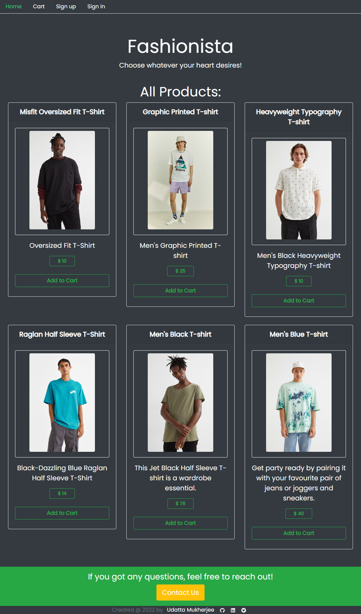
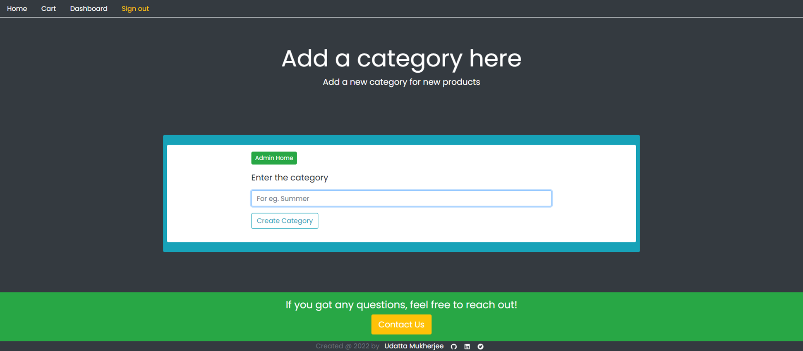
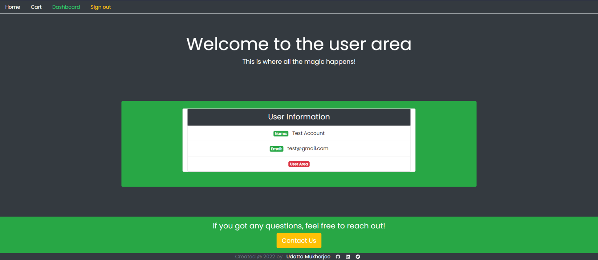

# Fashionista

A fullstack e-commerce application built with React, Node.js, Express, and MongoDB.

## Table of Contents

- [Overview](#overview)
- [Features](#features)
- [Technologies](#technologies)
- [Setup](#setup)
- [Usage](#usage)
- [Images](#images)
- [Contributing](#contributing)

## Overview

Fashionista is a fullstack e-commerce application built with React, Node.js, Express, and MongoDB. It is a single page application that allows users to browse through a catalog of products, add items to their cart, and checkout.

## Features

**General:**
- Responsive design
- User authentication and authorization using JWT tokens
- Stored passwords are hashed using crypto and salted using uuid
- User data,categories,orders and products are stored in MongoDB
- Admin and User routes are separated

**User Features:**
- Browse through a catalog of products
- Add items to your cart
- Remove items from your cart
- Checkout

**Admin Features:**
- Create new categories
- Create new products
- Edit existing products
- Delete products
- All user features

## Technologies

- React
- Node.js
- Express
- MongoDB
- Braintree(PayPal)
- Bootstrap
- Google Fonts

## Setup

The structure of the project is as follows:

```
fashionista
├── backend
├── frontend
```

### Backend

The backend is a Node.js application built with Express and MongoDB. It is located in the `backend` directory. Navigate to the `backend` directory with the following command:
    
```
cd backend
```

 To run the backend, you will need to have Node.js and MongoDB installed on your machine. You will also need to create a `.env` file in the `backend` directory with the following environment variables:

```
DATABASE=<your_mongo_uri>
PORT=<your_port>
SECRET=<your_jwt_secret>
MERCHANT_ID=<your_braintree_merchant_id>
PUBLIC_KEY=<your_braintree_public_key>
PRIVATE_KEY=<your_braintree_private_key>
```
Install the dependencies:

```
npm install
```
After you have created the `.env` file and installing the dependencies, you can run the backend by navigating to the `backend` directory and running the following commands:

```
npm run start
```
If you want to run the backend in development mode, you can run the following command:

```
npm run dev
```
The development mode uses `nodemon` to watch for changes in the code and restart the server automatically.

---

### Frontend

The frontend is a React application built with Create React App. It is located in the `frontend` directory. Navigate to the `frontend` directory with the following command:
    
```
cd frontend
```
To run the frontend, you will need to have Node.js installed on your machine. You will also need to create a `.env` file in the `frontend` directory with the following environment variables:

```
REACT_APP_BACKEND=<your_api_url>
```


Install the dependencies:

```
npm install
```

After you have created the `.env` file and installing the dependencies, you can run the frontend by navigating to the `frontend` directory and running the following command:

```
npm run start
```
### Closing Notes

- If everything is set up correctly, you should be able to access the frontend at `http://localhost:3000`. 

- You can access the backend at `http://localhost:8000/api` or the port you specified in the `.env` file and test the API endpoints with Postman.
Be sure to make the same changes in the `.env` file in the `frontend` directory. Any changes you make to the frontend will be reflected in the browser automatically.

 - You can use a hosted version of MongoDB or run MongoDB locally. If you want to run MongoDB locally, you can follow the instructions [here](https://docs.mongodb.com/manual/installation/). To use the hosted version of MongoDB, you can create a free account [here](https://www.mongodb.com/cloud/atlas) and create a cluster. You can then connect to the cluster and create a database. You can find the instructions [here](https://docs.atlas.mongodb.com/getting-started/). The database URI will be provided to you after you create the database. You can then copy the URI and paste it in the `.env` file in the `backend` directory. Do not forget to add your username and password to the URI in their respective places.

- Finally, you will need to create a Braintree account to accept payments. You can follow the instructions [here](https://developers.braintreepayments.com/guides/overview).


## Usage

To use the application, you will need to create an account. You can create an account as a user or an admin. The admin account will have access to the admin dashboard. The admin dashboard allows you to create new categories, create new products, edit existing products, and delete products. The user account will have access to the user dashboard. The user dashboard displays the account information. Both the user and the admin can browse through the catalog of products, add items to their cart, and checkout.

The database admin can browse the database and edit the data. This functionality is available by the use of Studio 3T for local databases and MongoDB Atlas for hosted databases.

## Images
**Home Page:**

**Sign up Page:**

**Sign in Page:**

**Cart Page (The card details are provided by Braintree):**

**Admin Dashboard:**

**Admin Create Category:**

**Admin Create Product:**

**Admin Edit Product:**

**User Dashboard:**


## Contributing

Pull requests are welcome. For major changes, please open an issue first to discuss what you would like to change.

---

### Link to the project : [Github Repository](https://github.com/udattam/Fashionista)


